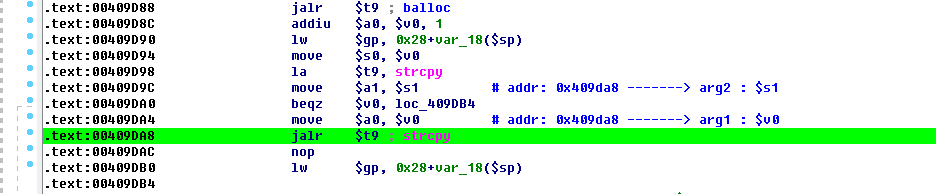
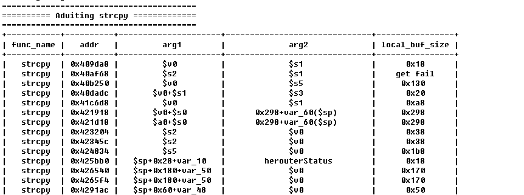
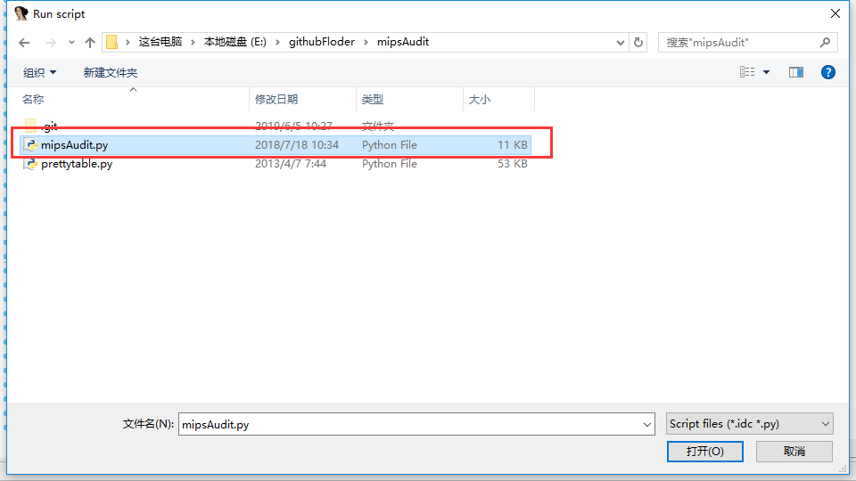
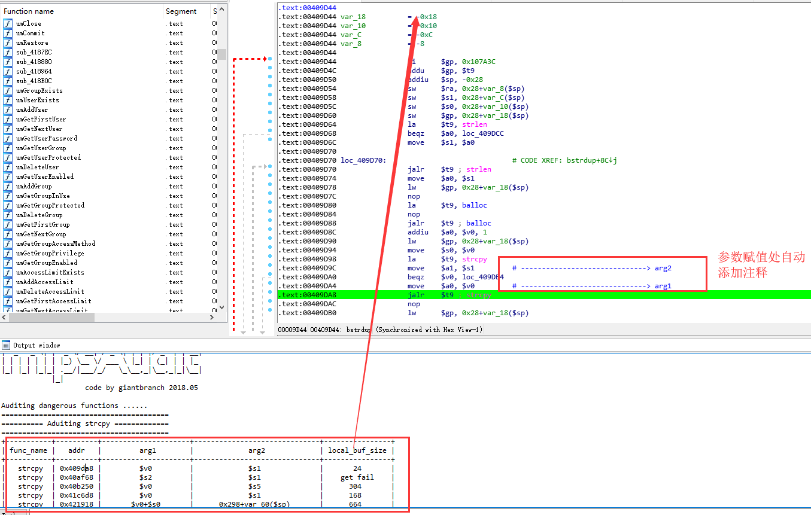
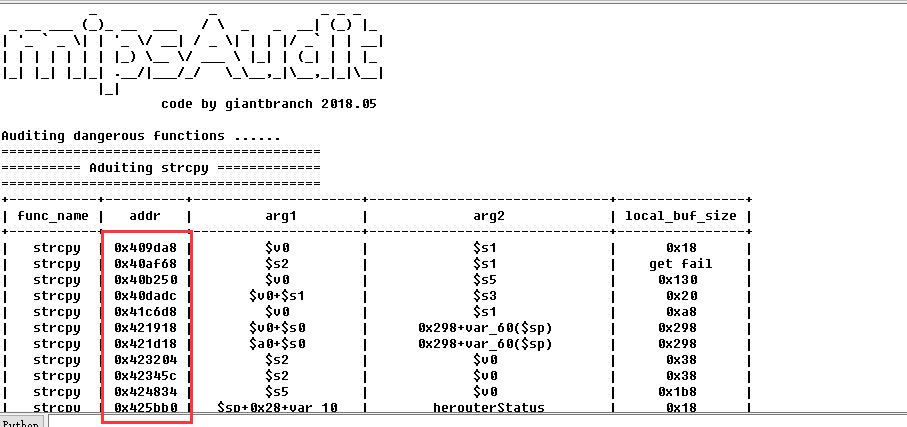

# IDAPython mipsAudit

## 简介

这是一个简单的IDAPython脚本。

进一步来说是MIPS静态汇编审计辅助脚本。

可能会有bug，欢迎大家完善。


## 功能

辅助脚本功能如下：

1. 找到危险函数的调用处，并且高亮该行（也可以下断点,这个需要自己去源码看吧）

2. 给参数赋值处加上注释

3. 最后以表格的形式输出函数名，调用地址，参数，还有当前函数的缓冲区大小

**大家双击addr那一列的地址，即可跳到对应的地址处**





## 审计的危险函数如下

```
dangerous_functions = [
    "strcpy", 
    "strcat",  
    "sprintf",
    "read", 
    "getenv"    
]

attention_function = [
    "memcpy",
    "strncpy",
    "sscanf", 
    "strncat", 
    "snprintf",
    "vprintf", 
    "printf"
]

command_execution_function = [
    "system", 
    "execve",
    "popen",
    "unlink"
]
```

## 使用

File - Script file


选择mipsAudit.py



即可看到效果



双击地址即可跳到对应的代码处


